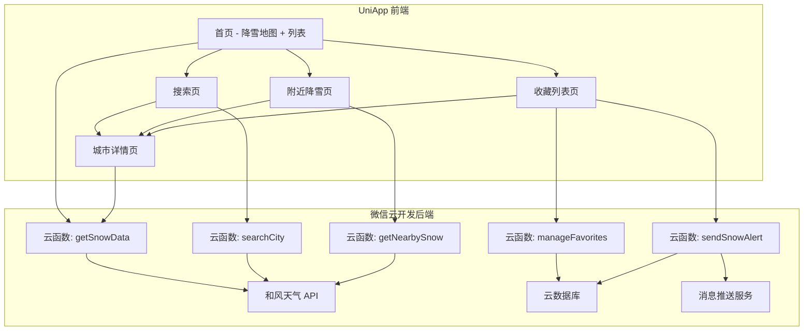

# 设计文档：西门催雪 — 下雪查找小程序

## 概述

「西门催雪」是一款跨平台小程序，采用 UniApp 框架（基于 Vue.js）开发，使用 TwindCSS 实现原子化样式，FontAwesome 提供图标支持。后端使用微信云开发（云函数 + 云数据库）提供数据服务。小程序通过调用第三方天气 API（和风天气 QWeather）获取实时降雪数据和预报信息，结合地图组件实现降雪区域可视化展示。

### 技术选型理由

- **UniApp（Vue.js）**：一套代码多端运行（微信小程序、H5、App），基于 Vue 3 Composition API，生态丰富，开发效率高
- **TwindCSS**：Tailwind CSS-in-JS 方案，无需构建步骤即可使用原子化 CSS，运行时生成样式，适合小程序环境
- **FontAwesome**：图标库丰富，支持 SVG 图标组件化使用，通过 `@fortawesome/vue-fontawesome` 集成到 Vue 组件中
- **M3 Expressive（Material Design 3 Expressive）**：Google 最新设计语言，强调情感化表达、动态色彩和圆润形态，通过 TwindCSS 自定义主题实现 M3 Expressive 设计令牌（色彩、圆角、字体、间距）
- **微信云开发**：免服务器运维，自带数据库、云函数、云存储，适合快速迭代；UniApp 通过 `wx.cloud` API 调用微信云函数
- **和风天气 API**：国内覆盖全面，支持实时天气、逐小时预报、逐日预报，有免费额度

## 架构



### 架构决策

1. **云函数作为中间层**：天气 API 密钥不暴露在前端，云函数负责请求转发、数据聚合和缓存
2. **前端本地缓存**：使用 `uni.setStorageSync` 实现 30 分钟本地缓存，减少云函数调用
3. **条件编译**：通过 UniApp `#ifdef MP-WEIXIN` 实现微信小程序特有功能（如 `wx.cloud` 调用云函数、订阅消息）
4. **TwindCSS 运行时方案**：使用 `@twind/preset-tailwind` 预设，在 Vue 组件中通过 `tw` 函数或 class 绑定使用原子化样式
5. **FontAwesome 按需引入**：仅注册使用到的图标，减小包体积

## 组件与接口

### 前端页面组件（UniApp Pages）

| 页面 | 路径 | 职责 |
|------|------|------|
| 首页 | `pages/index/index.vue` | 展示降雪地图和降雪城市列表 |
| 搜索页 | `pages/search/search.vue` | 城市搜索和结果展示 |
| 附近降雪 | `pages/nearby/nearby.vue` | 基于定位查找附近降雪 |
| 城市详情 | `pages/detail/detail.vue` | 城市降雪详情和预报 |
| 收藏列表 | `pages/favorites/favorites.vue` | 管理收藏城市 |

### 公共组件

| 组件 | 路径 | 职责 |
|------|------|------|
| SnowCard | `components/SnowCard.vue` | 降雪城市卡片（M3 Expressive 圆角卡片，动态色彩） |
| ForecastItem | `components/ForecastItem.vue` | 预报条目展示（M3 列表项样式） |
| ErrorRetry | `components/ErrorRetry.vue` | 错误提示 + 重试按钮（M3 Expressive 按钮） |
| EmptyState | `components/EmptyState.vue` | 空状态提示（M3 插图 + 文字） |

### UI 设计规范（M3 Expressive）

- **色彩系统**：基于 M3 Dynamic Color，主色调采用冰蓝/雪白色系，通过 TwindCSS 自定义主题令牌实现
- **形态**：大圆角（`rounded-3xl`）、柔和阴影，卡片和按钮采用 M3 Expressive 的圆润形态
- **字体**：使用 M3 推荐的字体层级（Display、Headline、Title、Body、Label）
- **动效**：页面切换和列表加载使用 M3 Expressive 的弹性动画（spring-based motion）
- **组件风格**：FAB 按钮、Filled/Tonal 按钮、M3 搜索栏、底部导航栏均遵循 M3 Expressive 规范

### 云函数接口

#### getSnowData

```typescript
// 请求
{ action: "list" | "detail", cityId?: string }

// 响应 - list
{
  snowRegions: [
    {
      cityId: string,
      cityName: string,
      province: string,
      temperature: number,
      snowLevel: "小雪" | "中雪" | "大雪" | "暴雪",
      latitude: number,
      longitude: number,
      updatedAt: string  // ISO 8601
    }
  ],
  updatedAt: string
}

// 响应 - detail
{
  cityId: string,
  cityName: string,
  current: {
    temperature: number,
    humidity: number,
    windSpeed: number,
    windDirection: string,
    snowLevel: string,
    visibility: number
  },
  forecast: [
    {
      date: string,
      snowLevel: string,
      snowPeriod: string,
      accumulation: number,  // 毫米
      tempHigh: number,
      tempLow: number
    }
  ],
  updatedAt: string
}
```

#### searchCity

```typescript
// 请求
{ keyword: string }

// 响应
{
  cities: [
    { cityId: string, cityName: string, province: string }
  ]
}
```

#### getNearbySnow

```typescript
// 请求
{ latitude: number, longitude: number, radius?: number }

// 响应
{
  nearbySnow: [
    {
      cityId: string,
      cityName: string,
      distance: number,  // 公里
      snowLevel: string,
      temperature: number
    }
  ],
  nearest: {
    cityId: string,
    cityName: string,
    distance: number,
    snowLevel: string
  } | null
}
```

#### manageFavorites

```typescript
// 请求
{ action: "add" | "remove" | "list", cityId?: string, openId: string }

// 响应
{
  favorites: [
    { cityId: string, cityName: string, snowStatus: string }
  ]
}
```

## 数据模型

### SnowRegion（降雪区域）

```typescript
/**
 * 降雪区域数据对象
 */
interface SnowRegion {
  cityId: string        // 城市唯一标识
  cityName: string      // 城市名称
  province: string      // 所属省份
  latitude: number      // 纬度
  longitude: number     // 经度
  temperature: number   // 当前温度（摄氏度）
  humidity: number      // 湿度百分比 (0-100)
  windSpeed: number     // 风速（km/h）
  windDirection: string // 风向
  snowLevel: "小雪" | "中雪" | "大雪" | "暴雪" | "无"
  visibility: number    // 能见度（公里）
  updatedAt: string     // ISO 8601 时间戳
}
```

### SnowForecast（降雪预报）

```typescript
/**
 * 降雪预报数据对象
 */
interface SnowForecast {
  cityId: string        // 城市唯一标识
  date: string          // 预报日期 YYYY-MM-DD
  snowLevel: string     // 预计降雪强度
  snowPeriod: string    // 预计降雪时段，如 "08:00-14:00"
  accumulation: number  // 预计累计降雪量（毫米）
  tempHigh: number      // 最高温度
  tempLow: number       // 最低温度
}
```

### FavoriteCity（收藏城市）

```typescript
/**
 * 收藏城市记录（云数据库）
 */
interface FavoriteCity {
  _id: string           // 记录 ID（云数据库自动生成）
  openId: string        // 用户 OpenID
  cityId: string        // 城市 ID
  cityName: string      // 城市名称
  createdAt: string     // 收藏时间 ISO 8601
}
```

### CacheEntry（缓存条目）

```typescript
/**
 * 本地缓存条目
 */
interface CacheEntry<T> {
  data: T               // 缓存的数据
  timestamp: number     // 缓存时间戳（毫秒）
  ttl: number           // 缓存有效期（默认 30 分钟，毫秒）
}
```


## 正确性属性（Correctness Properties）

*正确性属性是系统在所有有效执行中都应保持为真的特征或行为——本质上是关于系统应该做什么的形式化陈述。属性是人类可读规范与机器可验证正确性保证之间的桥梁。*

### Property 1: 降雪城市过滤正确性

*For any* 天气数据集合，Snow_Query_Service 返回的降雪城市列表中的每个城市都应当处于降雪状态（snowLevel 不为 "无"），且所有处于降雪状态的城市都应出现在列表中。

**Validates: Requirements 1.1**

### Property 2: 降雪列表项包含完整信息

*For any* SnowRegion 数据对象，格式化为列表项后的输出应包含城市名称、当前温度、降雪强度和更新时间四个字段。

**Validates: Requirements 1.2**

### Property 3: 城市搜索匹配正确性

*For any* 搜索关键词和城市数据集，搜索返回的每个城市名称都应包含该关键词，且城市数据集中所有名称包含该关键词的城市都应出现在结果中。

**Validates: Requirements 2.1**

### Property 4: 城市详情包含完整信息

*For any* 城市详情数据，格式化后的输出应包含降雪状态、温度、湿度、风力和未来 24 小时降雪预报信息。

**Validates: Requirements 2.2**

### Property 5: 附近降雪过滤与排序

*For any* 用户位置坐标、搜索半径和降雪区域集合，getNearbySnow 返回的结果中每个区域到用户的距离都应小于等于指定半径，且结果按距离升序排列。

**Validates: Requirements 3.1, 3.2**

### Property 6: 降雪预报天数与字段完整性

*For any* 有效的城市预报数据，详情页展示的预报应包含恰好 3 天的数据，每天的数据应包含降雪时段、降雪强度和累计降雪量。

**Validates: Requirements 4.1, 4.2**

### Property 7: 收藏添加/移除往返一致性

*For any* 收藏列表和城市，将城市添加到收藏后该城市应出现在列表中；随后将该城市移除后，收藏列表应恢复到添加前的状态。

**Validates: Requirements 5.1, 5.4**

### Property 8: 收藏城市降雪状态摘要完整性

*For any* 收藏列表中的城市集合，查看收藏列表时每个城市都应附带当前降雪状态摘要信息。

**Validates: Requirements 5.2**

### Property 9: 降雪提醒触发正确性

*For any* 收藏城市，当该城市的降雪状态从"无"变为任意降雪等级时，系统应触发一次降雪提醒通知。

**Validates: Requirements 5.3**

### Property 10: 缓存有效期判定

*For any* 缓存条目，当当前时间与缓存时间戳的差值小于 30 分钟时缓存应判定为有效，大于等于 30 分钟时应判定为无效。

**Validates: Requirements 6.1**

### Property 11: 强制刷新更新缓存

*For any* 已缓存的数据，执行强制刷新后缓存时间戳应更新为当前时间，且缓存数据应为最新获取的数据。

**Validates: Requirements 6.2**

### Property 12: 离线模式返回缓存数据

*For any* 网络不可用的状态，若本地存在缓存数据，系统应返回缓存数据并附带离线模式标识和缓存时间。

**Validates: Requirements 6.3**

### Property 13: SnowRegion 序列化往返一致性

*For any* 有效的 SnowRegion 数据对象，将其序列化为 JSON 后再反序列化，应产生与原始对象等价的结果。

**Validates: Requirements 7.1, 7.2, 7.4**

### Property 14: 格式化输出为有效 JSON

*For any* 有效的 SnowRegion 数据对象，格式化输出的字符串应为合法的 JSON，且包含原始对象的所有字段。

**Validates: Requirements 7.3**

## 错误处理

### 网络错误

| 场景 | 处理方式 |
|------|----------|
| 天气 API 请求超时 | 云函数设置 10 秒超时，返回错误码，前端展示 ErrorRetry 组件（含 FontAwesome `fa-rotate-right` 重试图标） |
| 天气 API 返回异常 | 云函数记录日志，返回友好错误信息 |
| 云函数调用失败 | 前端捕获异常，优先使用本地缓存，无缓存则展示 ErrorRetry 组件 |
| 网络完全不可用 | 使用本地缓存数据，标注离线模式（FontAwesome `fa-wifi-slash` 图标） |

### 数据错误

| 场景 | 处理方式 |
|------|----------|
| JSON 反序列化失败 | 记录错误日志，返回空数据并提示用户刷新 |
| 数据字段缺失 | 使用默认值填充，标记数据不完整 |
| 缓存数据损坏 | 清除损坏缓存，重新从服务端获取 |

### 权限错误

| 场景 | 处理方式 |
|------|----------|
| 用户拒绝位置权限 | 展示引导弹窗，提供跳转设置页按钮 |
| 用户拒绝订阅消息 | 降级处理，不发送通知但不影响其他功能 |

## 测试策略

### 测试框架选型

- **单元测试**：使用 Vitest（与 Vue 3 / Vite 生态深度集成）
- **属性测试**：使用 [fast-check](https://github.com/dubzzz/fast-check) 进行属性基测试（Property-Based Testing）
- **组件测试**：使用 `@vue/test-utils` 测试 Vue 组件
- **每个属性测试至少运行 100 次迭代**

### 单元测试覆盖

单元测试聚焦于具体示例、边界情况和错误条件：

- 搜索无结果时的提示信息（需求 2.3）
- 搜索请求超时的错误处理（需求 2.4）
- 附近无降雪时的推荐逻辑（需求 3.3）
- 位置权限拒绝的引导流程（需求 3.4）
- 预报数据不可用的提示（需求 4.3）
- 无缓存且无网络的错误提示（需求 6.4）

### 属性测试覆盖

每个正确性属性对应一个属性测试，使用 fast-check 实现：

| 属性 | 测试标签 |
|------|----------|
| Property 1 | Feature: ximencuixue-snow-finder, Property 1: 降雪城市过滤正确性 |
| Property 2 | Feature: ximencuixue-snow-finder, Property 2: 降雪列表项包含完整信息 |
| Property 3 | Feature: ximencuixue-snow-finder, Property 3: 城市搜索匹配正确性 |
| Property 4 | Feature: ximencuixue-snow-finder, Property 4: 城市详情包含完整信息 |
| Property 5 | Feature: ximencuixue-snow-finder, Property 5: 附近降雪过滤与排序 |
| Property 6 | Feature: ximencuixue-snow-finder, Property 6: 降雪预报天数与字段完整性 |
| Property 7 | Feature: ximencuixue-snow-finder, Property 7: 收藏添加/移除往返一致性 |
| Property 8 | Feature: ximencuixue-snow-finder, Property 8: 收藏城市降雪状态摘要完整性 |
| Property 9 | Feature: ximencuixue-snow-finder, Property 9: 降雪提醒触发正确性 |
| Property 10 | Feature: ximencuixue-snow-finder, Property 10: 缓存有效期判定 |
| Property 11 | Feature: ximencuixue-snow-finder, Property 11: 强制刷新更新缓存 |
| Property 12 | Feature: ximencuixue-snow-finder, Property 12: 离线模式返回缓存数据 |
| Property 13 | Feature: ximencuixue-snow-finder, Property 13: SnowRegion 序列化往返一致性 |
| Property 14 | Feature: ximencuixue-snow-finder, Property 14: 格式化输出为有效 JSON |

### 测试组织

```
tests/
├── unit/                        # 单元测试
│   ├── search.test.ts           # 搜索功能测试
│   ├── nearby.test.ts           # 附近降雪测试
│   ├── cache.test.ts            # 缓存逻辑测试
│   └── error.test.ts            # 错误处理测试
├── property/                    # 属性测试
│   ├── snow-filter.prop.ts      # Property 1
│   ├── formatting.prop.ts       # Property 2, 4, 6, 8
│   ├── search.prop.ts           # Property 3
│   ├── nearby.prop.ts           # Property 5
│   ├── favorites.prop.ts        # Property 7, 9
│   ├── cache.prop.ts            # Property 10, 11, 12
│   └── serialization.prop.ts    # Property 13, 14
└── components/                  # 组件测试
    ├── SnowCard.test.ts         # SnowCard 组件测试
    └── ErrorRetry.test.ts       # ErrorRetry 组件测试
```
